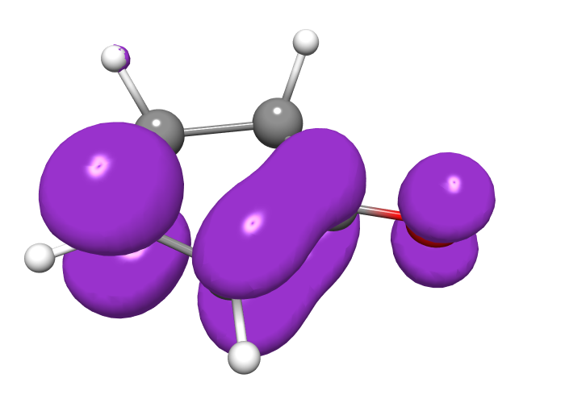
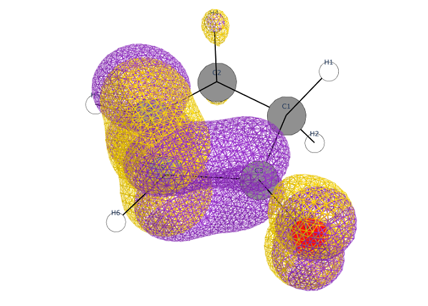

# Cube

Simple visualizer of [cube files](paulbourke.net/dataformats/cube/). Jupyter notebook compatible. Blender compatible.

## Installation

    pip install -e git+https://github.com/yanzewu/cube

Prerequesties:
- plotly
- scikit-image (optional): For displaying smoother grids.
- plyfile (optional): For exporting PLY files.

## Usage

The simplist way is 

    import cube
    cube.plot_cube('my_cube_file').show()

To make the grid smoother, first download scikit-image, and change the line to

    cube.plot_cube('my_cube_file', surf_kwargs={'smooth_grid':True})

To clear the background, change the line to

    fig = cube.plot_cube('my_cube_file')
    cube.clear_axis(fig)
    fig.show()

To plot multiple cube files in the same figure, do

    cubefile1 = cube.read_cube('my_cube_file_1')
    cubefile2 = cube.read_cube('my_cube_file_2')

    fig = cube.plot_molecule(cubefile1.charges, cubefile1.coords, style='ballstick')
    # assuming all cubefiles are describing the same geometry

    X, Y, Z = cube.meshgrid()
    fig = cube.plot_isosurface(X, Y, Z, cubefile1.data, style='mesh', figure=fig)
    fig = cube.plot_isosurface(X, Y, Z, cubefile2.data, style='mesh', color='Gold', figure=fig)
    # please change the style and color if necessary.

    cube.set_aspect(fig)
    fig.show()

Several useful functions are
- read_cube(): Read a cube file into `Cube` instance. A `Cube` instance has the following attributes:
    - charges: A list of charges.
    - coords: An (N x 3) numpy array.
    - origin: The origin of the grids.
    - vecs: The unit vectors of the grid edges.
    - data: The (Nx x Ny x Nz) numpy array of voxel data.
    - meshgrid(): Generate an meshgrid representing the coordinate system.
- plot_molecule(): Plot a molecule instance from charge and coordinates.
- plot_isosurface(): Plot an isosurface from voxel data at certain value (specified by `iso`). If the data contains both positive and negative, surfaces will be drew at both iso and -iso.
- plot_volume(): Plot density graph from voxel data. The range can be controled by `vmin` and `vmax`.
- plot_cube(): A wrapper of `plot_molecule()` and `plot_isosurface()`. Plot the molecule and isosurface from a cube file.
- util.clear_axis(): Remove the axis and labels.
- util.set_background_color(): Set the background color of figure.
- util.set_aspect(): Make the aspect of figure same as axis span.

The arguments are described in docstrings.

More examples can be found in [example.ipynb](doc/example.ipynb).

## Support for 3D Modeling

Plots generated from `plot_molecule()` (with style other than `None`) and `plot_isosurface()` (with `smooth_grid=True`) can be exported to PLY files, which then can be imported to 3D modeling softwares (e.g. Blender). Here is an example for exporting a molecule to Blender:

    import cube
    c = cube.read_cube('doc/example.cube')
    fig = cube.plot_molecule(c.charges, c.coords, style='ballstick')
    cube.util.mesh2ply(fig['data'][-1]).write('example.ply')

In Blender (version >= 3.3), select "File > Import > Stanford (.ply)" to import the file. To assign the same color as given by `cube`, first add a new material to the object, then in the material panel, find "Base Color", click the little dot beside the color panel, and select "Color Attribute". The color attribute is also available as an input option in the node view.

